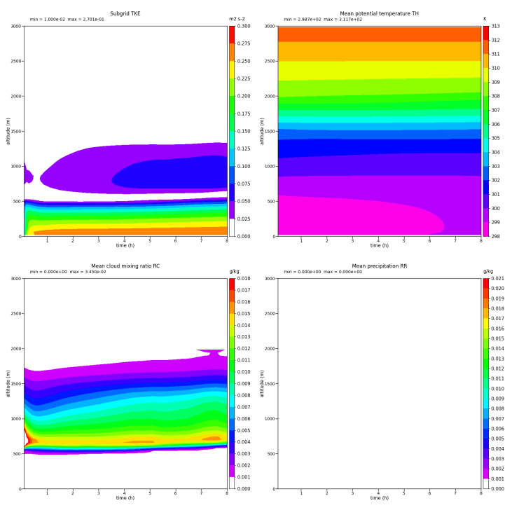

Shallow cumulus convection (BOMEX) (3)
=============================================================

Case description
----------------

The BOMEX (BOundary Layer EXperiment) case simulates shallow cumulus convection over tropical ocean and is commonly used to evaluate shallow
convection parameterizations and Large Eddy Simulation configurations. It is based on :cite:t:`siebesma_large_2003`.

.. warning::

   This kind of simulation is not parallelized and can only be run on 1 core.

.. note::

   You can find the workflow as well as the namelists and the scripts to launch this case study here :

   .. treeview::

      - :dir:`folder` |MNH_directory_extract_current|/examples/integration_cases/local/BOMEX

        - :dir:`folder` 001_prep_ideal : directory to prepare the initial condition
        - :dir:`folder` 002_mesonh : directory to run the model
        - :dir:`folder` 003_python : directory to plot the figure

   The different steps must be performed in the order indicated by the directory numbers.

Numerical set-up
------------------------

.. tab-set::

   .. tab-item:: Grids

      .. list-table::
         :header-rows: 1
         :widths: 40 60

         * - Parameter
           - Value

         * - Domain
           - Cartesian flat domain

         * - Horizontal grid
           - 1 x 1 pt (1D)

         * - Horizontal resolution
           - 40 km

         * - Vertical grid
           - 75 levels (0–3000 m)

         * - Vertical spacing
           - 40–300 m stretched grid

   .. tab-item:: Dynamics

      .. list-table::
         :header-rows: 1
         :widths: 40 60

         * - Parameter
           - Value

         * - Integration length
           - 28800 s (8 h)

         * - Time step
           - 120 s

         * - Coriolis force
           - Enabled

   .. tab-item:: Physics

      .. list-table::
         :header-rows: 1
         :widths: 40 60

         * - Scheme
           - Configuration

         * - Turbulence
           - TKEL (1D, BL89)

         * - Cloud microphysics
           - ICE3

         * - Shallow convection
           - EDKF

         * - Deep convection
           - NONE

         * - Radiation
           - NONE

   .. tab-item:: Forcings

      .. list-table::
         :header-rows: 1
         :widths: 50 50

         * - Parameter
           - Value

         * - Sensible heat flux
           - 9.2 W m\ :sup:`-2`

         * - Latent heat flux
           - 6.16e-5 kg m\ :sup:`-2` s\ :sup:`-1`

         * - Friction velocity
           - 0.28 m s\ :sup:`-1`

         * - Roughness length (Z0)
           - 0.035 m

         * - Large-scale forcing
           - Geostrophic forcing + subsidence above 2600 m

   .. tab-item:: Diagnostics

      .. list-table::
         :header-rows: 1
         :widths: 50 50

         * - Parameter
           - Value

         * - LES diagnostics
           - Averages over 18000–21600 s

Validation
------------------------

   Figure for BOMEX
