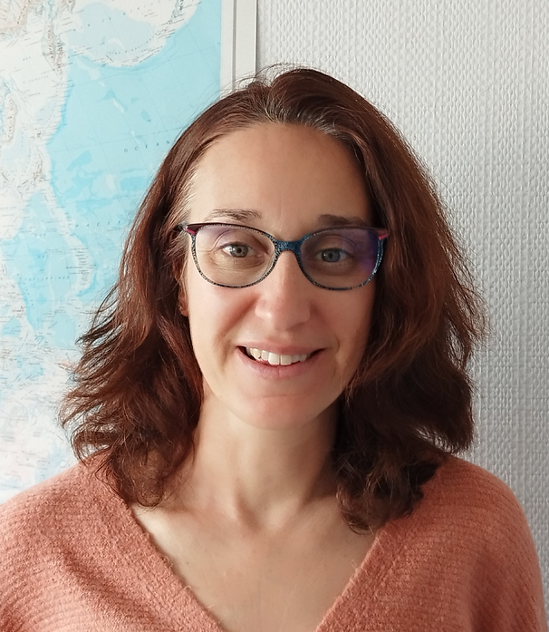

Infolettre #11
================================================

**12 octobre 2026.** Version française, English version `here <newsletter_11_english.html>`_.

Chers utilisateurs, chères utilisatrices de Méso-NH,

Voici ci-dessous la 11ème infolettre de notre communauté. Vous y trouverez un entretien avec les deux animateur et animatrice du tout récent Comité scientifique de Méso-NH, les nouvelles de l’équipe support et la liste des dernières publications utilisant Méso-NH.

Entretien avec `Christelle Barthe <mailto:christelle.barthe@cnrs.fr>`_ (LAERO) et `Didier Ricard <mailto:didier.ricard@meteo.fr>`_ (CNRM)
******************************************************************************************************************

|pic1|     |pic2|

.. |pic2| image:: photo_dr.jpg
  :width: 230

Christelle et Didier, vous êtes les animatrice et animateur du Comité scientifique de Méso-NH. Pourriez-vous nous expliquer ce que c'est, et qui y participe ?
  L'organisation autour du code communautaire Méso-NH a été repensée en profondeur cette année. En lieu et place du comité de pilotage qui existait auparavant, deux instances ont été créées : un Comité scientifique et un Comité des tutelles, en interactions fortes avec le Service Méso-NH et ses deux pôles : le Pôle technique et le Pôle utilisateur.ices.

  Le Comité scientifique (CS) a vocation à discuter, structurer et évaluer les développements nécessaires du code Méso-NH en assurant leur suivi. Il s’organise autour de réunions trimestrielles sur des thèmes ou problèmes spécifiques, soulevés par les développeur.euses ou les utilisateur.ices, afin de favoriser les interactions et le codéveloppement, et anticiper les évolutions du modèle.

  Les membres du comité ont été choisi.es pour leur expertise sur les thématiques scientifiques au cœur du développement du code Méso-NH (schémas numériques, convection, turbulence, microphysique, rayonnement, électricité atmosphérique, aérosols, chimie, schémas urbains, océan et couplage, feux, éoliennes). Les membres du SNO-CC (Service National d’Observation – Code Communautaire) participent à chaque réunion du Comité scientifique pendant laquelle un.e spécialiste de la thématique abordée, extérieur.e à Méso-NH, est invité.e pour nous apporter un regard neuf. 

Quel est l'objectif de ce Comité scientifique ? à quoi sert-il ?
  Le premier objectif du Conseil scientifique est de suivre les développements scientifiques et techniques du modèle Méso-NH, définir des priorités scientifiques de développement du code et donner des recommandations de développements techniques prioritaires au Pôle Technique. Le deuxième objectif est de faire remonter au Comité des tutelles les avancées, les difficultés rencontrées ainsi que les besoins identifiés nécessitant des moyens. Tout cela pour répondre aux priorités scientifiques du CNRS, de Météo-France et de la communauté des utilisateur.ices, et améliorer l’offre de service du code communautaire pour les applications académiques, appliquées et sociétales.

De quoi avez-vous pu discuter jusqu'à présent ?
  Le CS s’est réuni pour la première fois le 1er juillet 2026. En plus d’informations générales sur l’actualité de Méso-NH, cette première réunion a traité de la représentation de la microphysique. Les sujets abordés ont balayé des questions très techniques comme la cohérence entre les différentes variables microphysiques, des thèmes à la frontière avec d’autres schémas de Méso-NH comme l’initialisation du schéma à 2 moments par les aérosols, mais aussi des chantiers à plus long terme comme l’unification des schémas microphysiques (KHKO, ICE3, LIMA) pour faciliter leur maintenance et leur utilisation. Les évolutions futures de la microphysique dans Méso-NH ont aussi été évoquées. 

  La deuxième réunion du CS s’est tenue le 23 septembre 2026. Nous avons d’abord fait un retour sur les actions en cours sur les schémas microphysiques qui avaient été décidées à la précédente réunion, puis nous avons débattu de la suite du portage de Méso-NH sur GPU, et les travaux récents sur l’implicitation des flux de surface ont été présentés. Un point sur les travaux et priorités du Pôle technique a également été présenté par Philippe Wautelet.

Quelles perspectives voyez-vous pour le Comité scientifique ?
  Les prochaines séances vont être dédiées à des problèmes ou des thèmes qui nécessitent un traitement assez rapide (diagnostics dans les fichiers de sortie, efficacité numérique, étapes de préparation des simulations…) et qui permettront d’améliorer l’ergonomie et l’efficacité du modèle. Nous souhaitons aussi aborder le rôle de l’IA dans la modélisation, toujours en s’entourant d’invités spécialistes du sujet.

